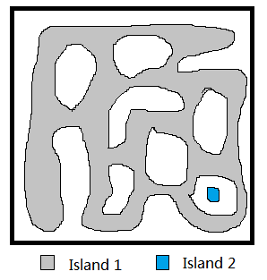

<script src="https://yjian012.github.io/Yi-blog/scripts.js"></script>
<link rel="stylesheet" href="https://yjian012.github.io/Yi-blog/styles.css">
<pre>
M934 Shortest Bridge description:
  You are given an n x n binary matrix grid where 1 represents land and 0 represents water.
  An island is a 4-directionally connected group of 1's not connected to any other 1's. There are exactly two islands in grid.
  You may change 0's to 1's to connect the two islands to form one island.
  Return the smallest number of 0's you must flip to connect the two islands.
Constraints:
  $n == grid.length == grid[i].length$
  $2 <= n <= 100$
  $grid[i][j]$ is either 0 or 1.
  There are exactly two islands in grid.
</pre>

The first step is, of course, finding a '1'. Then the typical approach is, to record the first island of '1's, then do a bfs from there and look for another '1'.

The concept is actually quite simple, but there're a few things that we can modify to increase efficiency.

```cpp
#pragma GCC optimize("Ofast","inline","-ffast-math")
#pragma GCC target("avx,mmx,sse2,sse3,sse4")
class Solution {
    int sz;
    void findB(const vector<vector<int>>& grid,int& x,int& y){
    static auto _=[](){ios_base::sync_with_stdio(false);cin.tie(0);cout.tie(0);return 0;}();
        for(x=0;x<sz;++x){
            for(y=0;y<sz;++y){
                if(grid[x][y]==1) return;
            }
        }
    }
    int checkCo(const vector<vector<int>>& grid,int x,int y){
        if(x<0||x>=sz||y<0||y>=sz) return 3;
        else return grid[x][y];
    }
    const array<array<int,2>,4> directions={ { {-1,0},{0,-1},{0,1},{1,0} } };
    void dfs(vector<vector<int>>& grid,int x,int y){
        int val=checkCo(grid,x,y);
        if(val>=2) return;
        grid[x][y]=2;
        if(val==0){q[qM++]=128*x+y;return;}
        for(auto &dir:directions) {
            dfs(grid,x+dir[0],y+dir[1]);
        };
    }
    int q[10000];
    int qM=0;
    int bfs(vector<vector<int>>& grid) {
        int l=0;
        int level=1;
        while(qM>l){
            int lay=qM-l;
            while(lay--){
                int p=q[l++];
                for(auto &dir:directions) {
                    int t=p+128*dir[0]+dir[1];
                    int x=t/128;
                    int y=t%128;
                    int val=checkCo(grid,x,y);
                    if(val>=2) continue;
                    if(val==1) {qM=0;return level;}
                    grid[x][y]=2;
                    q[qM++]=t;
                }
            }
            level++;
        }
        qM=0;
        return level;
    }
    // void printG(const vector<vector<int>>& grid){
    //     for(auto& v:grid){
    //         for(auto i:v) cout<<i<<", ";
    //         cout<<endl;
    //     }
    // }
public:
    int shortestBridge(vector<vector<int>>& grid) {
        sz=grid.size();
        int x,y;
        findB(grid,x,y);
        dfs(grid,x,y);
        return bfs(grid);
    }
};
```
To save space and time, we can use the original grid to record the visited cells by changing the value to 2. It's easy to modify the program to record the information on a hashset if we are not allowed to modify the original grid.
The first small trick is, instead of returning -1 from "checkCo()" when the coordinates are out of range, it returns 3. This way, a single check is enough to determine if we need to proceed, instead of two.

Another one is, we can add the first layer of '0's outside the island into the queue while we do the dfs. Since we change its value to 2 right away, there will be no duplicates. So there is no need to add the entire island to the bfs queue.

Also, since the grid is at most 100*100, I decided to use 128*x+y to store the two coordinates. It can't deal with out of range cases, so I must make sure that only use this form when the coordinates are valid. Not sure if it's faster than pair&lt;int,int&gt;, though.

The story doesn't end here. I was thinking about if there is a more efficient algorithm for the first part - to find the surface of the island. I thought, we just needed to find the surface of the island, not the entire island. And as long as the island has a "normal" shape - i.e, not hyperbolic (which was a big part of my research) or fractal, the number of elements on the perimeter should be much less than the area. So, if I just follow the boundary of the island, it would be much more efficient when the island is large.

The following code implements this algorithm:
```cpp
class Solution {
    void printG(const vector<vector<int>>& grid){
        for(auto& v:grid){
            for(auto i:v) cout<<i<<", ";
            cout<<endl;
        }
        cout<<"----------------------"<<endl;
    }
    int sz;
    struct Edge{
        int d;//0=up,1=right,2=down,3=left
        int x;//above(h) or to the left of(v), range [0,sz]
        int y;//range [0,sz]
        bool operator!=(const Edge& a){
            return this->d!=a.d||this->x!=a.x||this->y!=a.y;
        }
    };
    void findB(const vector<vector<int>>& grid,int& x,int& y){
        for(x=0;x<sz;++x) for(y=0;y<sz;++y) if(grid[x][y]==1) return;
    }
    int q[10000];
    int qM=0;
    int checkCo(const vector<vector<int>>& grid,int x,int y){
        if(x<0||x>=sz||y<0||y>=sz) return 3;
        else return grid[x][y];
    }
    void up(Edge& edg,vector<vector<int>>& grid){
        int &x=edg.x,&y=edg.y,&d=edg.d;
        if(x==0){++d; return;}
        if(grid[x-1][y]==0){++d;grid[x][y]=2;q[qM++]=(x-1)*128+y; return;}
        if(y==0){--x;return;}
        if(grid[x-1][y-1]==0){--x;grid[x][y]=2;q[qM++]=x*128+y-1;return;}
        d+=3;
        x--;
        y--;
        grid[x][y]=2;
    }
    void right(Edge& edg,vector<vector<int>>& grid){
        int &x=edg.x,&y=edg.y,&d=edg.d;
        if(y==sz-1){++d; return;}
        if(grid[x][y+1]==0){++d;grid[x][y]=2;q[qM++]=x*128+y+1; return;}
        if(x==0){++y;return;}
        if(grid[x-1][y+1]==0){++y;grid[x][y]=2;q[qM++]=(x-1)*128+y;return;}
        d--;
        x--;
        y++;
        grid[x][y]=2;
    }
    void down(Edge& edg,vector<vector<int>>& grid){
        int &x=edg.x,&y=edg.y,&d=edg.d;
        if(x==sz-1){++d; return;}
        if(grid[x+1][y]==0){++d;grid[x][y]=2;q[qM++]=(x+1)*128+y; return;}
        if(y==sz-1){++x;return;}
        if(grid[x+1][y+1]==0){++x;grid[x][y]=2;q[qM++]=x*128+y+1;return;}
        d--;
        x++;
        y++;
        grid[x][y]=2;
    }
    void left(Edge& edg,vector<vector<int>>& grid){
        int &x=edg.x,&y=edg.y,&d=edg.d;
        if(y==0){d=0; return;}
        if(grid[x][y-1]==0){d=0;grid[x][y]=2;q[qM++]=x*128+y-1; return;}
        if(x==sz-1){--y;return;}
        if(grid[x+1][y-1]==0){--y;grid[x][y]=2;q[qM++]=(x+1)*128+y;return;}
        d--;
        x++;
        y--;
        grid[x][y]=2;
    }
public:
    int shortestBridge(vector<vector<int>>& grid) {
        sz=grid.size();
        cout<<"before:\n";
        printG(grid);
        Edge edg;
        edg.d=0;
        findB(grid,edg.x,edg.y);//pointing up, '1' is on the right, so island will always be on the right
        q[qM++]=edg.x*128+edg.y;
        Edge lastE=edg;
        do{
            switch(edg.d){
                case 0:up(edg,grid); break;
                case 1:right(edg,grid); break;
                case 2:down(edg,grid); break;
                case 3:left(edg,grid); break;
            }
            //cout<<"d is "<<edg.d<<",x is "<<edg.x<<", y is "<<edg.y<<endl;
        }while(edg!=lastE);
        cout<<"after:\n";
        printG(grid);
        
        
        
        return 0;
    }
};
```
Unfortunately, it doesn't work. I noticed that in the third test case, 
```
1, 1, 1, 1, 1, 
1, 0, 0, 0, 1, 
1, 0, 1, 0, 1, 
1, 0, 0, 0, 1, 
1, 1, 1, 1, 1, 
```
The edge we find is the the left of the first '1', and after we go around the entire island, we don't find anything to continue to work with. So, the algorithm doesn't work when the second island is inside the first island.

In this particular case, we may cross the island and look for a '0' and start from there. But it doesn't work in general. The island can be in any strange shape, and the algorithm doesn't work if it's not singly connected.


It works nicely when the islands are singly connected, though. E.g,
```
before:
0, 1, 
1, 0, 
----------------------
after:
0, 2, 
1, 0, 
----------------------
before:
0, 1, 0, 
0, 0, 0, 
0, 0, 1, 
----------------------
after:
0, 2, 0, 
0, 0, 0, 
0, 0, 1, 
----------------------
before:
1, 1, 1, 1, 1, 
1, 0, 0, 0, 1, 
1, 0, 1, 0, 0, 
1, 0, 0, 0, 1, 
1, 1, 1, 1, 1, 
----------------------
after:
1, 2, 2, 2, 1, 
2, 0, 0, 0, 2, 
2, 0, 1, 0, 0, 
2, 0, 0, 0, 2, 
1, 2, 2, 2, 1, 
----------------------
```
It may be useful somewhere else.