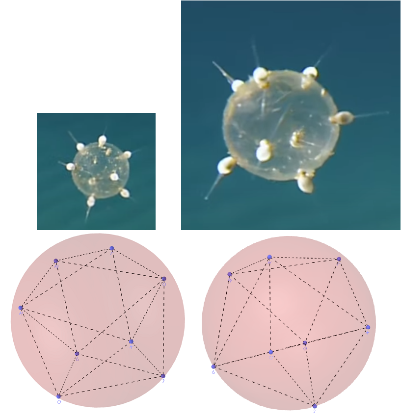

<link rel="stylesheet" href="https://yjian012.github.io/Yi-blog/styles.css">

So I wrote a short program to calculate the shapes that correspond to those problems that were mentioned in the previous post. Actually, the first one that I ran did not correspond to any of them. I was thinking, maybe the mechanism is on the surface, so instead of using a function of the distances between the points, maybe I should use a function that corresponds to the distance on the surface - or equivalently, the angle between them? Suppose that the capsules keep releasing a certain chemical on the surface that repels other capsules, so that they will find the spot that has the least concentration of the chemical, and the chemical degrades in time. The concentration from each capsule would be inversely proportional to the distance on the surface. If I assume the "force" is proportional to the concentration, the energy would be log of the angle.

I thought the solution would be similar to the cases with the Euclidean distance - but it's totally different. I was surprised by the result!
<pre>
function=$-\sum\ln\delta_{ij}$, 8 vertices:
 0.0      , 0.0     , 1.0     ,
 0.646104 , 0.621228,-0.443424,
-0.614415 ,-0.575319, 0.539911,
-0.0590085,-0.946303,-0.317851,
 0.0283015, 0.968172, 0.248679,
 0.923682 ,-0.269269, 0.272589,
-0.951041 , 0.240249,-0.194424,
 0.0052322, 0.000739,-0.999986,
</pre>
It looks like two perpendicular rectangles, nothing like the solutions to the other problems.
The difference actually starts with $n=4$. The solutions to all the Euclidean distance problems are a regular tetrahedron, which is not the solution to this problem - it's a square! Indeed, the product of the vertex-center-vertex angles that a regular tetrahedron makes is about 48.6478, and the one for a square is $\left(\frac{\pi}{4}\right)^4\pi^2\approx 60.0868$. This is probably not the right model for this problem, I suppose.

The result of Thomson problem - i.e., vertices are equal charges and the force is inverse-square to the distance, is
<pre>
function=$\sum 1/r_{ij}$ (Thomson problem), 8 vertices:
 0.0     , 0.0     , 1.0     ,
 0.67198 ,-0.675175,-0.304273,
 0.90106 , 0.297473, 0.315596,
 0.341148, 0.451193,-0.824647,
-0.970893, 0.172403, 0.166266,
-0.292125,-0.901176, 0.320226,
-0.506278,-0.341556,-0.791847,
-0.145709, 0.982264, 0.118012,
</pre>
Which is indeed a square antiprism.

I also tried the Whyte's problem (I didn't find any reference about this problem, except that the name was mentioned on wikipedia), where the force is inversly proportional to the distance. The result is
<pre>
function=$\sum -\ln r_{ij}$ (Whyte's problem), 8 vertices:
 0.0     , 0.0     , 1.0     ,
-0.96761 , 0.171449, 0.185302,
-0.082313, 0.97464 , 0.208092,
 0.482057, 0.538236,-0.69132 ,
 0.50466 ,-0.715044,-0.483767,
 0.933948, 0.019279, 0.356889,
-0.530202,-0.085225,-0.843577,
-0.337356,-0.901919, 0.269692,
</pre>
It looks very similar to the max volume shape, but doesn't seem to be exactly the same.
And when I compared it with the shape of Tuscaridium cygneum, it seemed closer to the shape than the maximum volume shape.

I wonder if this is the actual shape, and how the organism builds it!